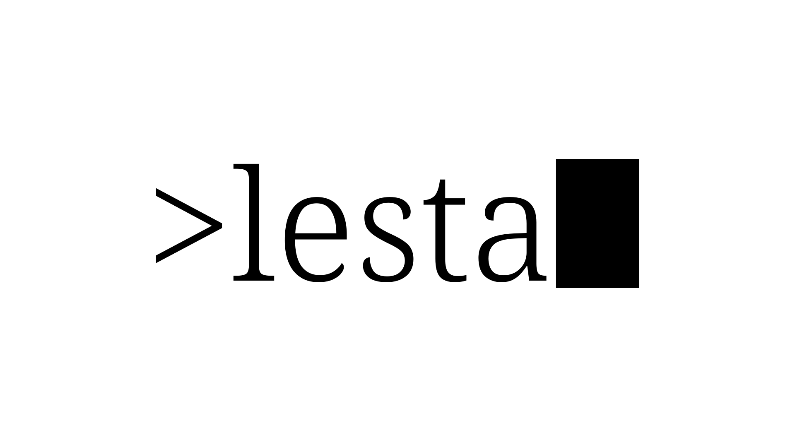

Markdown and SCSS only Jekyll theme.

This theme is a single landing page mostly for setting up a project description or useful information, it only needs one `index.md` file.

# Contributions

Feel free to leave your contribution here, I would really appreciate it!
Also, if you have any doubts or troubles using this package just contact me or leave an issue.
